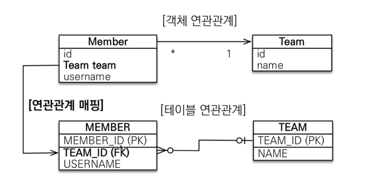
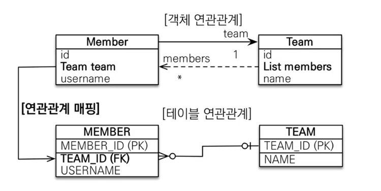

### 연관관계 매핑시 고려할 것들
- 다중성
  - 다대일 : @ManyToOne 
  - 일대다 : @OneToMany
  - 일대일 : @OneToOne
  - 다대다 : @ManyToMany , 실무에서 쓰면 안된다.

- 단방향, 양방향
  - 테이블 
    - F.K 하나로 join 가능
    - 사실 방향이라는 개념이 없다.
  - 객체
    - 참조용 필드가 있는 곳 으로만 참조가 가능하다.
    - 한쪽만 참조하면 단방향이고 양쪽이 서로 참조하면 양방향(단방향이 2개이지만 마치 양방향 처럼 보이는 것)이다.

- 양방향 일때 연관관계의 주인
  - 테이블은 F.K 하나만으로 두 테이블의 연관관계를 맺을 수 있다.
  - 객체 양방향 관계는 A -> B , B -> A 처럼 참조가 2군데에 있을 때를 말한다.
  - 객체 양방향 관계는 참조가 2군데 있고, 둘중에 테이블의 F.K를 관리하는 곳을 지정해야 한다.
  - 연관관계의 주인 : F.K를 관리하는 참조
  - 연관관계 주인의 반대편 : F.K에 영향을 주지 않음, 단순 조회만 가능

DB 설계할 때 N쪽에 F.K가 와야 하는 것은 당연함!

[다대일 단방향]

[다대일 양방향]

