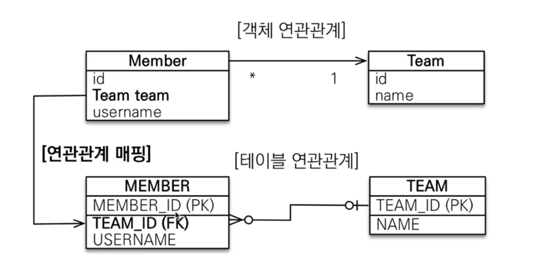
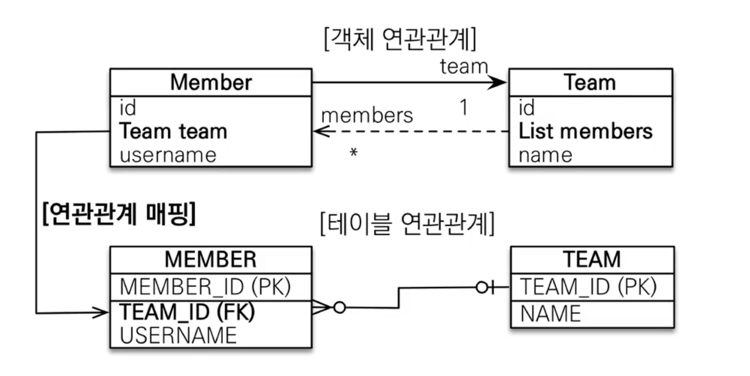
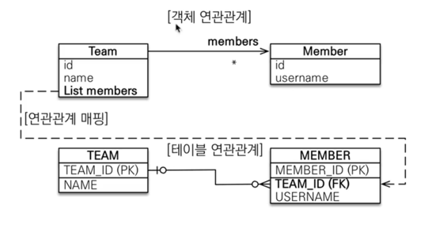
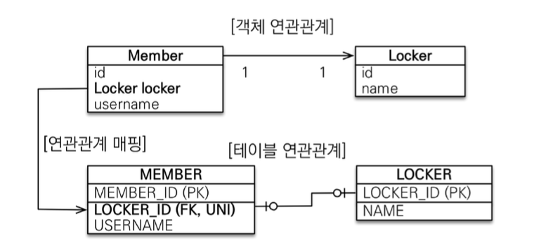
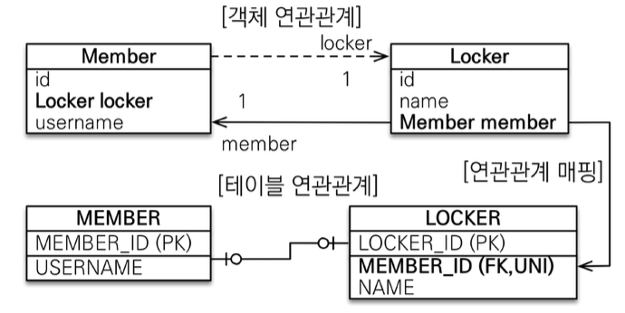
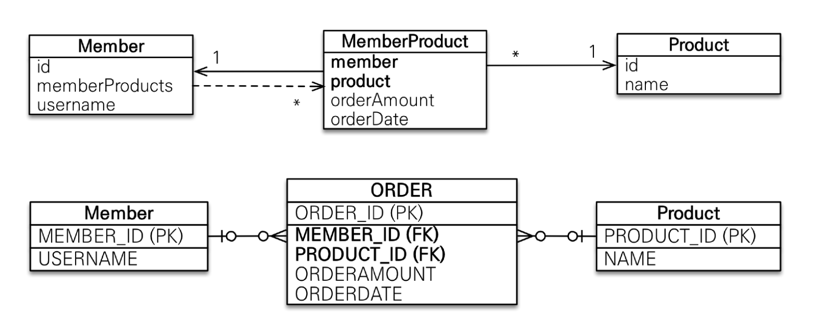

### 연관관계 매핑시 고려할 것들
- 다중성
  - 다대일 : @ManyToOne 
  - 일대다 : @OneToMany
  - 일대일 : @OneToOne
  - 다대다 : @ManyToMany , 실무에서 쓰면 안된다.


- 단방향, 양방향
  - 테이블 
    - F.K 하나로 join 가능
    - 사실 방향이라는 개념이 없다.
  - 객체
    - 참조용 필드가 있는 곳 으로만 참조가 가능하다.
    - 한쪽만 참조하면 단방향이고 양쪽이 서로 참조하면 양방향(단방향이 2개이지만 마치 양방향 처럼 보이는 것)이다.


- 양방향 일때 연관관계의 주인
  - 테이블은 F.K 하나만으로 두 테이블의 연관관계를 맺을 수 있다.
  - 객체 양방향 관계는 A -> B , B -> A 처럼 참조가 2군데에 있을 때를 말한다.
  - 객체 양방향 관계는 참조가 2군데 있고, 둘중에 테이블의 F.K를 관리하는 곳을 지정해야 한다.
  - 연관관계의 주인 : F.K를 관리하는 참조
  - 연관관계 주인의 반대편 : F.K에 영향을 주지 않음, 단순 조회만 가능

#### 다대일

DB 설계할 때 N쪽에 F.K가 와야 하는 것은 당연함!
[다대일 단방향]

[다대일 양방향]


---

#### 일대다 (권장X)

1인쪽에서 F.K를 관리하겠다
[일대다 단방향]


```roomsql
    update
        Member 
    set
        TEAM_ID=? 
    where
        MEMBER_ID=?
```
연관관계 주인이 Team쪽에 있다고 하고 Team 엔티티를 건드렸는데,
왜 Member 테이블에 뭔가 update가 돼?

- 일대다 단방향은 1이 연관관계의 주인이다.
- 테이블의 일대다 관계는 항상 N쪽에 F.K가 있다.
- 객체와 테이블의 차이로 인해서 반대편 테이블의 F.K를 관리하는 구조이다.
- @JoinColumn을 꼭 사용해야 한다. 그렇게 하지 않으면 join테이블 방식을 사용한다.(중간에 테이블을 하나 추가함)


- 단점
  - Entity가 관리하는 F.K가 다른 테이블에 있다.
  - 연관관계 관리를 위하여 추가로 update sql을 실행한다.
- **그래서 일대다 단방향 매핑보다는 설계가 조금 덜 깔끔해지더라도 다대일 양방향 매핑을 사용하는 것이 좋다.**

[일대다 양방향]
- 일대다 양방향 매핑은 공식적으로 존재하지는 않는다.
- @JoinColumn(insertable=false, updatable=false)
- 읽기 전용 필드를 사용해서 앙뱡항 처럼 사용하는 방법
- 다대일 양방향을 사용하면 된다.

---

#### 일대일

- 일대일 관계는 당연히 그 반대도 일대일이다.
- 주 테이블이나 대상 테이블 중에 F.K를 선택할 수 있다.
- F.K에 유니크(UNI) 제약 조건 추가할 수 있다.


주 테이블에 F.K
- 주 객체가 대상 객체의 참조를 가지는 것 처럼 주 테이블에 F.K를 두고 대상 테이블을 찾는다.
- 주 테이블만 조회하여도 대상 테이블의 데이터를 확인 가능하다.
- 값이 없으면 F.K에 null을 허용하는 것이 단점.
  - 대상 테이블에 외래키가 있는 경우 null허용 없이 처리를 완료할 수 있기 때문이다.
  


대상 테이블에 F.K
- 대상 테이블에 F.K가 존재하는 것이다.
- 주 테이블과 대상 테이블을 일대일에서 일대다 관계로 변겨할 때 테이블의 구조를 유지할 수 있다는 장점이 있다.
- Proxy 기능의 한계로 지연 로딩으로 설정해도 항상 즉시 로딩된다.



---

#### 다대다

- 중간 테이블을 두어서 일대다, 다대일 관계로 풀어야 한다.
- @JoinTable로 연결 테이블을 지정할 수 있다.
- @ManyToMany를 @OneToMany , @ManyToOne로 나눠서 사용함.
- 다대다 매핑은 실무에서 사용하지 않아야 한다.



MEMBER_ID 와 PRODUCT_ID를 묶어서 P.K로 할 수도 있지만,
비즈니스 적으로 의미없는 P.K(ORDER_ID)를 하나 추가로 설정하는게 유연성 측면에서 더 좋음.
모든 테이블에 일관성 있게 @GeneratedValue를 설정함.

---


