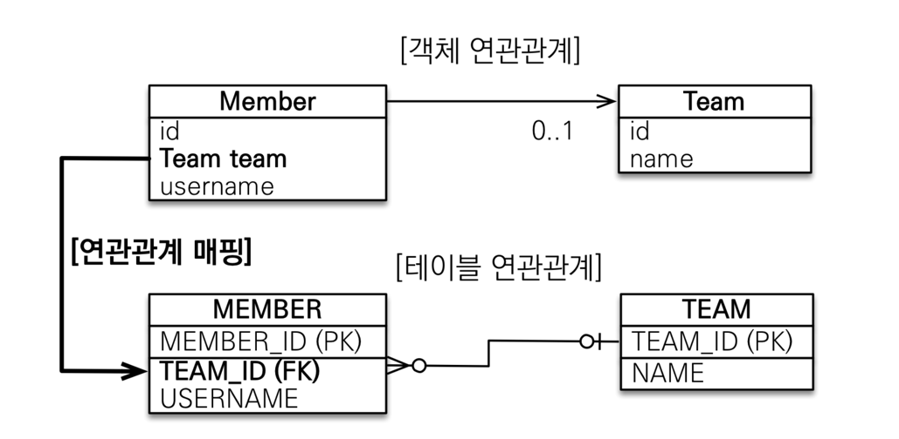

객체를 테이블에 맞추어서 모델링 하였을 때 Member 클래스의 teamId(외래키)가 Team 클래스의 id를 참조하는 상황
```java
public class Member {
    ...
    @Column(name = "TEAM_ID")
    private Long teamId; //외래키값을 그대로 사용했음   
}

public class Team {
    @Id @GeneratedValue
    @Column(name = "TEAM_ID")
    private Long id;
    ...
}

public static void main(String[] args) {
    Team team = new Team();
    team.setName("TeamA");
    em.persist(team); //영속 상태가 되면 무조건 p.k값이 설정이 되야 영속 상태가 된다.

    Member member = new Member();
    member.setUsername("member1");
    member.setTeamId(team.getId()); // -> 뭔가 객체지향스럽지 않음, 이것은 외래키 식별자를 직접 다루는 상황
    em.persist(member);

    //조회할때도 문제가 생김
    Member findMember = em.find(Member.class, member.getId());
    Long teamId = findMember.getTeamId();
    Team findTeam = em.find(Team.class, teamId);    //식별자를 다시 조회하는데 사용하는 문제
}
```
위의 코드는 이런 문제가 있다.
- 외래키 식별자를 직접 다루는 상황
- 식별자를 다시 조회하는데 사용

DB 테이블은 외래키를 이용해서 조인을 한 후 서로 연관된 테이블의 값을 찾을 수 있다.
하지만, 객체는 참조를 해야 서로 연관된 객체를 찾을 수 있다. 

### 단방향 연관관계

```java
public class Member {
    ...
    @Column(name = "TEAM_ID")
    private Long teamId;

    이 코드를 아래와 같이 바꿈

    @ManyToOne  //Member 클래스 입장에서는 Many이므로 
    @JoinColumn(name = "TEAM_ID") //Team team과 실제 Member 테이블의 TEAM_ID(외래키)컬럼과 매핑을 해야하기 때문에  
    private Team team;
}
```

현재 Member와 Team은 N:1 관계이다.(하나의 팀에 여려명의 사람이 들어갈 수 있다는 조건하에) -> @ManyToOne
Team team과 실제 Member 테이블의 TEAM_ID(외래키)컬럼과 매핑을 해야하기 때문에 -> @JoinColumn(name = "TEAM_ID")



**객체의 참조와 DB의 외래키를 매핑을 해서 연관관계 매핑을 할 수 있다.**


