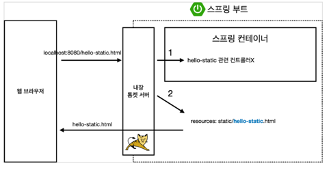
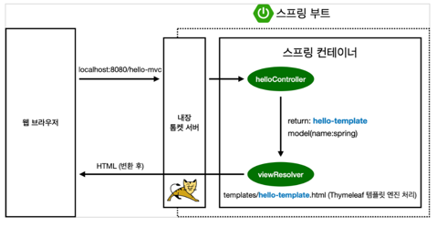
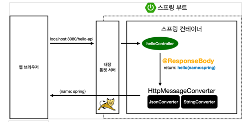
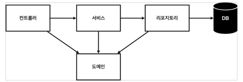

### 웹을 개발한다는 것은

크게 , <b>정적 컨텐츠, MVC와 템플릿, API</b> 3가지 방법이 있다

- 정적 컨텐츠: 파일을 그대로 웹브라우저에 내려주는 것
    - Ex) 웹 브라우저에서 localhost:8080/hello-static.html을 치면 내장 톰켓 서버가 요청을 받고
    스프링한테 넘기면, 컨트롤러에 우선순위가 있기 때문에 controller쪽에서 먼저 찾아본다. hello controller는 있지만
    hello-static controller는 없었기 때문에, resources에 있는 static/hello-static.html을 찾는다.그리고 있으면
    반환함.


- MVC와 템플릿: 서버에서 프로그래밍해서 HTML을 동적으로 바꿔서 내리는 것
    -  View는 화면을 그리는 것에 모든 것을 집중(화면에 관련된 일만)
    -  Controller는 비즈니스 로직과 관련이 있거나 내부적인 것을 처리하는데 집중 
    -  Model에 관련된 화면에서 필요한 것들을 담아서 넘겨주는 것


- API: JSON 구조 포맷으로 클라이언트한테 데이터를 전달하는 방식

---

### @RequestParam , @ResponseBody

1) http://xxx.x.x?index=1&page=2

2) http://xxxx.x.x/index/1

--- 

1번은 @RequestParam을 사용하여 나타낸다
```java
@GetMapping("lecture-number")
    public String lectureZero(@RequestParam("step") int id, Model model) {
        model.addAttribute("step", id);
        return "lecture-number";
    }
```
이 코드를 보면, http://localhost:8080/lecture-number?step=1 형태로 전달을 해야한다.
URL이 전달될 때, step 파라미터(step에 담긴 value)를 받아오게 된다

만약 RequestParam에 key값이 존재하지 않으면, "BadRequest 로 4**" error가 발생한다
이를 방지하고자 default 값을 설정해준다("DefaultValue"를 이용하여 기본 값을 설정)
(" required=false " 속성을 꼭 명시해야함)


파라미터가 많아지게 된다면??? -> Map을 통하여 파라미터를 컨트롤할 수 있다.
```java
@GetMapping("test")
public void testMethod(@RequestParam HashMap<String,String> parameterMap){
    String testData = parameterMap.get("testParam");
}
```
---

2번은 @PathVariable을 통해 Rest api에서 값을 호출할 때 주로 많이 사용한다
```java
@PostMapping("delete/{index}")
@ResponseBody
public void testMethod(@PathVariable("index") int id ){
    return testService.deleteId(id);
}
```
URL에서 각 구분자에 들어오는 값을 처리해야 할 때 사용

---

실제로는 두개 모두 복합적으로 사용을 많이 함

```java
@GetMapping("test")
public List<Test> testMethod( @PathVariable("index) int id,
    @RequestParam(value="date",required="false)Date userDate) {
}
```

### "MVC, 템플릿 엔진"

 (이 경우 키는 name, 값은 spring)

viewResolver: 뷰를 찾아주고, 템플릿 엔진을 연결 시켜줌

templates/hello-template(helloController에서 return 한 것).html을 찾아서 
Thymeleaf 템플릿 엔진에 전달

그후 템플릿 엔진이 랜더링을 해서 변환한 HTML을 웹 브라우저에 넘겨줌(정적일때는 변환을 하지 않았음...위에서)

---
View를 찾아서 템플릿 엔진을 통해서 화면을 랜더링 해서 HTML을 웹 브라우저에 넘겨주느냐
아니면, API방식으로 데이터를 바로 내리냐...

---
@ResponseBody: HTTP Body부분에 이(return 부분) 데이터를 직접 넣어주겠다.<br/>문자열이 요청한 클라이언트에 그대로 내려감. View가 존재하지 않음.

```java
@GetMapping("lecture-date")
    @ResponseBody
    public String lectureDate(@RequestParam(value = "practicedDate", required = false) String date) {
        return "강의 수강 Month: " + date;  
    }
```
"@ResponseBody 원리"



- HTTP BODY부분에 문자 내용을 직접 반환함
- viewResolver가 아닌 HttpMessageConverter가 동작함
- 단순 문자면 StringHttpMessageConverter, 객체면 MappingJackson2HttpMessageConverter
- byte 처리 등등 기타 여러 HttpMessageConverter가 기본으로 등록되어 있음
  - 참고: 클라이언트의 HTTP Accept 헤더와 서버의 컨트롤러 반환 타입 정보 둘을 조합해서
        HttpMessageConverter가 선택됨.

---
### 보통의 웹 애플리케이션의 계층이라..

- 컨트롤러: 웹 MVC의 컨트롤러 역할
  - 클라이언트의 요청을 받았을 때 그 요청에 대해 실제 업무를 수행하는 Service를 호출
    클라이언트가 보낸 데이터가 있다면 Service를 호출할 때 전달하기 쉽게 데이터의 가공
    모델의 업무 수행이 완료되면 그 결과를 바탕으로 화면을 구성하도록 View에 전달


- 서비스: 핵심 비즈니스 로직 구현
  - Controller의 요청을 받아 알맞은 정보를 가공후 Controller에게 재전달<br/>Repository를 상속받아 .findByID , .save()등의 함수 사용이 가능

- 리포지토리: 데이터베이스에 접근, 도메인 객체를 DB에 저장하고 관리
  - Entity에 의해 생성된 DB에 접근하는 메서드를 사용하기위한 interface
    JPA를 상속받음으로써 기본적인 CRUD의 동작(함수 사용)이 가능
    JpaRepository<대상 엔티티, Entity에 접근할 객체의 Type>
  
- DTO : 계층간의 데이터 교환을 위한 객체

- 도메인: 비즈니스 도메인 객체, Ex) 회원,주문,쿠폰 등 주로 데이터베이스에 저장하고 관리하는 것
  - DB의 테이블과 매핑되며 Entity class라고도 부름
    실제 DB에 저장되는 내용들을 구현하는 class이다.
    하나의 객체가 DB의 하나의 Column처럼 작용한다



---

### Test 

Test Case(코드를 코드로 검증하기!) -------> JUnit framework로 Test 실행

> 모든 Test는 순서가 보장되지 않음. 순서랑 상관없이 메소드별로 다 따로 동작하게 설계를 해야 한다.
  즉, 순서의존적으로 설계하면 <b>절대</b> 안된다.

Test가 하나 끝나면 데이터를 Clear 해줘야 함 <br>Ex
```java
  /*Test가 끝날때마다 데이터를 깔!끔!하게 지워주는 역할을 만들어주어야 한다.*/
    @AfterEach
    public void afterEach() {
        memberRepository.clearStore();
    }

```

---
### DI(Dependecy Injection)
기존의 코드를 보면 MemberService 클래스에서 사용하는 인스턴스(new MemberRepository())와 그것을 테스트하기 위한 클래스인
MemServiceTest클래스의 인스턴스(new MemberRepository())가 서로 다른 인스턴스를 나타내고 있었다. <br>이 상황에서는 다행이도 
Map<Long,Member>타입의 변수 store가 static으로 선언되어 있었기에 크게 상관은 없었지만, static이
아니라면 DB가 바로 다른 DB가 되면서 문제가 생긴다.<br> 그렇기 때문에, 같은 인스턴스를 사용하게 바꾸려면 memberRepository를 new를 써서 직접 생성하는게 아니라
외부에서 넣어주게 하면 된다.
```java
public class MemberService {
    private final MemberRepository memberRepository;

    public MemberService(MemberRepository memberRepository) {
        this.memberRepository = memberRepository;
    }
```

```java
class MemberServiceTest {

    MemberService memberService;
    MemoryMemberRepository memberRepository;

    @BeforeEach
    public void beforeEach() {
        memberRepository = new MemoryMemberRepository();
        memberService = new MemberService(memberRepository);
    }
```
이렇게 되면 같은 MemoryMemberRepository를 사용할 수 있다.
MemberService입장에서 직접 new를 이용해 인스턴스를 생성하지 않았고, 외부에서 memberRepository에 넣어주었다.
이런 것을 DI라고 한다.

---

### 컴포넌트 스캔 & 자동 의존관계 설정
```java
@Controller
public class MemberController {

} 
```

@Controller 어노테이션이 붙어있으면, 처음에 스프링이 뜰 때 컨테이너에 MemberController 객체를 생성해서 스프링에 넣어두고 스프링이 관리한다.
이것을 스프링 컨테이너에서 스프링 빈이 관리된다고 말을 한다더라

@Service도 마찬가지로 스프링이 뜰 때, 컨테이너에 @Service가 붙은 클래스를 등록해준다.
(@Repository도 동일함)

```java
import org.springframework.beans.factory.annotation.Autowired;

@Service
public class MemberService {
  private final MemberRepository memberRepository;
  
  public MemberService(MemberRepository memberRepository) {
    this.memberRepository = memberRepository;
  }
```
이렇게 쓰면, MemberController가 생성이 될때, 스프링 빈에 등록되어 있는 MemberService 객체를 가져다가
넣어준다.이게 바로 DI. 의존관계를 주입해주는 것! 뭔가 밖에서 넣어준 느낌이 들지 않나???...

또 MemberService도 아까 코드들을 봐보면, MemberRepository가 필요하다.
그래서 위의 MemberService 코드의 생성자에 @Autowired를 붙이면 된다.

*중요: 스프링 컨테이너에 올란간 것들만 @Autowired가 동작한다.
 
MemberController와 MemberService를 연결시켜줘야 한다면, @Autowired를 사용하면 된다는 소리이다.
```java
@Service
public class MemberService {
    private final MemberRepository memberRepository;

    @Autowired
    public MemberService(MemberRepository memberRepository) {
        this.memberRepository = memberRepository;
    }
```
이렇게 되면, MemberService를 스프링이 생성을 할 때,우선 @Service가 붙어 있는 MemberService클래스의 
객체를 컨테이너에 등록을 하면서, 위의 코드의 생성자 부분을 호출을 한다. 그런데 그때, @Autowired가 있으면
memberRepository가 필요하구나~ 라고 생각하고, 스프링 컨테이너에 있는 memberRepository를 딱 넣어준다. 
지금 전반적인 코드 같은 경우에는 MemberRepository인터페이스의 구현체로 MemoryMemberRepository가 있기 때문에,
MemoryMemberRepository를 딱! MemberService에 주입을 해주는 것이다. 

여기까지가 스프링 빈을 등록하는 방법중에 하나인 '컴포넌트 스캔과 자동 의존관계 설정'에 대한 내용이다. 
다시 정리하면, @Component가 있으면 스프링 객체를 하나씩 생성을 해서 스프링 컨테이너에 빈으로 자동 등록됨.
(@Controller가 있기 때문에 스프링 빈으로 자동으로 등록이 된 것)

@Component를 포함하는 아래 3개의 어노테이션도 스프링 빈으로 자동으로 등록된다.
- @Controller
- @Service
- @Repository

>스프링은 스프링 빈을 컨테이너에 등록할때 기본적으로 <b>싱글톤</b>으로 등록한다. 그렇기에 같은 스프링 빈이면
같은 인스턴스이다.

---

### 자바 코드로 직접 스프링 빈 등록

```java
@Configuration
public class SpringConfig {

    @Bean
    public MemberService memberService() {
        return new MemberService(memberRepository());
    }

    @Bean
    public MemberRepository memberRepository() {
        return new MemoryMemberRepository();
    }
}
```
스프링 빈에 MemberService와 MemberRepository가 등록이 되고(스프링이 올라올때 @Bean을 보고 memberService()와 memberRepository()를 스프링 빈에 올려준다)
그러면서 스프링 빈에 등록되어 있는 memberRepository()를 MemberService()의 인자에 넣어준다.

그러나 컨트롤러는 어찌 설정을 할 수 있는 부분이 아니니 컴포넌트 스캔 방식(@Controller,@Autowired)으로 그대로 유지한다.
그러면 MemberController(MemberService memberService) { } 에서 memberService에 내가 SpringConfig 클래스에서 빈으로 등록한
memberService를 넣어준다.

그러면 이 그림을 그려볼 수 있겠다.
<br/>memberController -> memberService -> memberRepository


- <마지막으로 MemberController와 MemberService가 연결되는 과정> 
  1. SpringConfig 클래스에 정의된 @Bean 어노테이션이 붙은 메서드들(memberService(), memberRepository())은 스프링이 애플리케이션을 시작할 때 호출되어 
  결과값이 스프링 컨테이너에 등록됨
  2. 이렇게 함으로써 MemberService 인스턴스와 MemoryMemberRepository 인스턴스가 
  각각 MemberService 타입과 MemberRepository 타입의 빈으로 스프링 컨테이너에 등록됨
  3. MemberController 클래스가 생성되는 시점에 스프링이 @Autowired 어노테이션을 발견하고 이를 처리
  4. 스프링은 MemberController의 생성자를 호출할 때, 생성자의 매개변수로 필요한 MemberService 타입의 객체를 스프링 컨테이너에서 찾습니다. MemberService 타입의 빈이 스프링 컨테이너에 등록되어 있으므로, 이 빈을 MemberController의 생성자에 주입하여 MemberController 객체를 생성. 
  이를 통해 MemberController와 MemberService가 연결

이 과정을 통해, MemberController는 스프링이 관리하는 MemberService의 인스턴스를 
사용하게 되는 것이다.
<br/>따라서 MemberController는 직접 MemberService를 생성하거나 관리할 필요 없이, 필요한 기능을 MemberService를 통해 사용할 수 있음.
---
DI(의존성 주입)에는 3가지 방법이 있다. 생성자 주입, 필드 주입, setter 주입이 있는데,
필드 주입 같은 경우 중간에 바꿔치기 하거나 그럴 수가 없다. 
의존관계는 실행 도중에 동적으로 변하는 경우가 거의 없는데 public으로 setter 메소드를 선언해 놓으면
외부에서 노출된 상태이기 때문에, 잘못 바꾸면 문제가 생길 수 있다.


*참고: 실무에서는 주로 정형화된 Controller, Service, Repository 같은 코드는 컴포넌트 스캔을 사용한다.
하지만 정형화되지 않거나, 상황에 따라 구현 클래스를 교체(갈아끼워야)해야 하면 설정을 통해 스프링 빈으로 등록하면 되는 거다.

만약 아직 저장소를 무엇을 사용할지 몰라 ,MemberRepository라는 인터페이스만 선언하고
구현 클래스로는 MemoryMemberRepository라는 임시 저장소를 만들었다고 가정하자.
추후에 저장소를 어떤 것으로 쓸지 결정이 되어 DBMemberRepository라는 구현 클레스를 사용해야 한다고 하면,
new MemoryMemberRepository()를 new DBMemberRepository() 로 바꿔주기만 하면 된다.
이게 직접 설정 파일을 사용했을때의 장점이다. 컴포넌트 스캔을 사용하면 여러 코드를 바꿔야 하지만... 
```java
<SpringConfig.java>
@Configuration
public class SpringConfig {

    @Bean
    public MemberService memberService() {
        return new MemberService(memberRepository()); 
    }
    @Bean
    public MemberRepository memberRepository() {
//        return new MemoryMemberRepository();
      return new DBMemberRepository();
    }

```