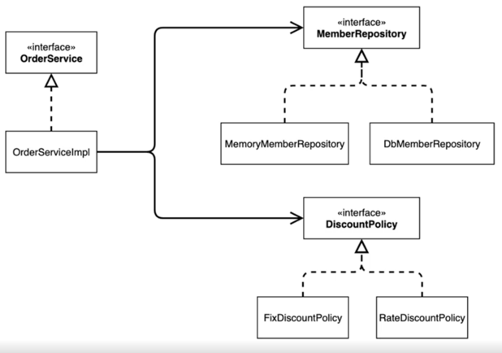
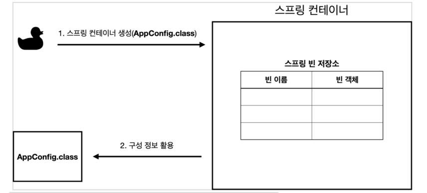
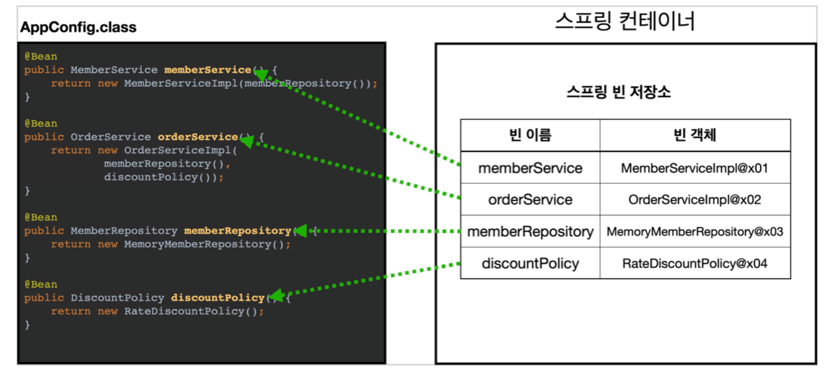
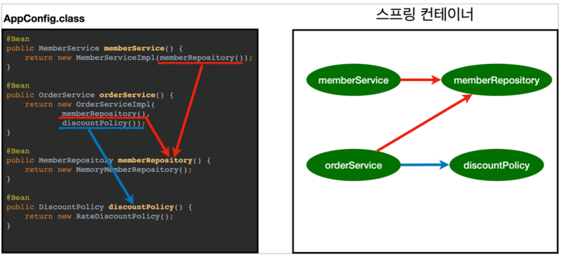

### 제어의 역전(IoC)
- 지금까지의 프로그램 흐름은 클라이언트 구현 객체가 스스로 필요한 구현 객체를 생성하고,연결하고,실행했다(구현 객체가 프로그램의 제어 흐름을 제어함)
- 하지만 AppConfig 라는 설정 클래스가 새로 생기면서 구현 객체는 자신의 로직을 실행하는 것에만 집중하게 되었다. 즉, 프로그램을 제어하는 힘이 AppConfig에게 생긴 것이다.
OrderServicImpl은 자기가 필요한 인터페이스를 호출하지만 어떤 구현 객체들이 들어올지는 모르는 상태인 것이다.
- OrderServicImpl도 AppConfig에 의해 생성된다. 이렇게 되면 OrderService 인터페이스에 대한 구현 객체를
OrderServiceImpl이 아닌 다른 구현 객체를 사용하길 원한다면, 바꾸면 된다. 이러한 사실들을 모른채 OrderServiceImpl은 자신의 서비스 로직만 묵묵히 실행한다.
- 이렇게 프로그램의 전반적인 흐름을 직접 제어하는 것이 아닌, 어떤 외부에서 관리하고 생성하고 하는 것을 '제어의 역전(IoC)'라고 한다.

### 의존관계 주입(Dependency Injection)

- 코드 상에서 OrderServiceImpl은 DiscountPolicy 인터페이스에 의존한다. 하지만 DiscountPolicy discountPolicy로 필드만 선언할 뿐
DiscountPolicy 인터페이스에 맞는 구현 객체를 직접 명시하지는 않았다.
- 의존 관계는 '정적인 클래스 의존 관계' 와 실행 시점에 결정되는 '동적인 객체(인스턴스) 의존 관계' 로 분리되서 생각할 수 있다고 한다.

그러면 이 두 의존 관계에 대해서 간략하게 알아보자.

<정적인 클래스 의존 관계>

이 의존 관계는 말그대로 정적인 관계이다. 서버를 실행 시키지 않더라도 import문을 통해 분석을 할 수 있다.
클래스 다이어그램이 이 예시이다.(소프트웨어 공학 수업에서 배움..)


이 그림을 보면 OrderServiceImpl은 MemberRepository에 의존하고 DiscountPolicy에도 의존하고 있다. 이것들은 인터페이스이며, 구현객체에 직접 의존하지 않아 DIP원칙을 잘 준수하고 있는것 같다.
하지만 이 의존관계들은 어디까지나 정적인 클래스 의존 관계이기 의존하고 있는 인터페이스에
어떤 구현 객체가 필요한지는 알 수 없다.

<동적인 객체 인스턴스 의존 관계>

- '실행 시점(런타임)'에 어떤 외부에서 구현 객체를 생성하고, 클라이언트에 전달하여
클라이언트와 서버의 실제 의존 관계가 연결되는 것을 '의존 관계 주입'이라고 한다.
('의존'이라는게 성질보다는 어떤 관계에 가깝기 때문에 의존 관계라는게 더 와닿는 다고
하는데, 나도 그렇게 생각한다,,?)
- 객체 인스턴스를 생성하고 그 참조값을 전달하여 연결되어 진다.
- 의존 관계 주입을 사용하면 클라이언트 코드(OrderServiceImpl)을 직접 바꾸지 않고, 클라이언트가 호출하는
대상의 타입 인스턴스를 변경할 수 있다.(FixDiscountPolicy->RateDiscountPolicy로 변경한 것 처럼)
- 의존 관계 주입을 사용하면 아까 위에서 봤던 정적 클래스 다이어그램의 의존 관계들을 변경하지 않고, 동적인 객체
인스턴스를 쉽게 변경할 수 있다.
---

지금까지 사용했던 AppConfig 클래스처럼 구현 객체들을 직접 생성해주고 관리하면서
의존 관계들을 주입 해주는 것들을 <b>`IoC 컨테이너`</b> 혹은 <b>`DI 컨테이너`</b>
라고 한다. 추가로 오브젝트 팩토리,어셈블러라고 부르기도 한다. 
---

### @Configuration
설정 정보 혹은 구성 정보를 담당하는 클래스(AppConfig)에 붙혀주는 어노테이션이다.


```java
@Configuration
public class AppConfig {

    @Bean
    public MemberService memberService() {
        return new MemberServiceImpl(memberRepository());
    }

    @Bean
    public MemberRepository memberRepository() {
        return new MemoryMemberRepository();
    }

    @Bean
    public DiscountPolicy discountPolicy() {
//        return new FixDiscountPolicy();
        return new RateDiscountPolicy();
    }

    @Bean
    public OrderService orderService() {
        return new OrderServiceImpl(memberRepository(), discountPolicy());
    }
}
```
(MemberApp 실행시 로그 중 일부)
```java
19:31:33.441 [main] DEBUG o.s.b.f.s.DefaultListableBeanFactory -- Creating shared instance of singleton bean 'org.springframework.context.annotation.internalConfigurationAnnotationProcessor'
19:31:33.518 [main] DEBUG o.s.b.f.s.DefaultListableBeanFactory -- Creating shared instance of singleton bean 'org.springframework.context.event.internalEventListenerProcessor'
19:31:33.520 [main] DEBUG o.s.b.f.s.DefaultListableBeanFactory -- Creating shared instance of singleton bean 'org.springframework.context.event.internalEventListenerFactory'
19:31:33.521 [main] DEBUG o.s.b.f.s.DefaultListableBeanFactory -- Creating shared instance of singleton bean 'org.springframework.context.annotation.internalAutowiredAnnotationProcessor'
19:31:33.521 [main] DEBUG o.s.b.f.s.DefaultListableBeanFactory -- Creating shared instance of singleton bean 'org.springframework.context.annotation.internalCommonAnnotationProcessor'
//위에 5개는 스프링이 내부적으로 필요해서 등록하는 스프링 Bean
        
19:30:27.105 [main] DEBUG o.s.b.f.s.DefaultListableBeanFactory -- Creating shared instance of singleton bean 'appConfig'
19:30:27.108 [main] DEBUG o.s.b.f.s.DefaultListableBeanFactory -- Creating shared instance of singleton bean 'memberService'
19:30:27.111 [main] DEBUG o.s.b.f.s.DefaultListableBeanFactory -- Creating shared instance of singleton bean 'memberRepository'
19:30:27.113 [main] DEBUG o.s.b.f.s.DefaultListableBeanFactory -- Creating shared instance of singleton bean 'discountPolicy'
19:30:27.114 [main] DEBUG o.s.b.f.s.DefaultListableBeanFactory -- Creating shared instance of singleton bean 'orderService'
//아래 5개는 @Bean 어노테이션을 통해 등록했던 스프링 Bean
```
추가로 Bean이 등록되는 형태를 보면,
```java
@Bean
public MemberService memberService() {
return new MemberServiceImpl(memberRepository());
}
```
이 코드를 예시로 하면, Key는 memberService Value는 new MemberServiceImpl 인스턴스이다.
그리고 꺼낼 때는 memberService 이름을 주고 꺼내면 된다.

### 스프링 컨테이너

```java
ApplicationContext applicationContext = new AnnotationConfigApplicationContext(AppConfig.class);
MemberService memberService = applicationContext.getBean("memberService", MemberService.class);
OrderService  orderService = applicationContext.getBean("orderService", OrderService.class);
```

- ApplicationContext가 스프링 컨테이너이다.
- ApplicationContext는 인터페이스이다.(다형성이 적용됨)
- 스프링 컨테이너는 XML 기반으로 만들 수도 있고, 어노테이션 기반의 자바 설정 클래스로도 만들 수 있다.
- 기존에는 AppConfig를 통해서 직접 객체를 생성하고 DI를 했었지만, 이제는 스프링 컨테이너를 통해서 사용하게 되었다.
- 스프링 컨테이너는 `@Configuration`이 붙은 `AppConfig` 를 설정 정보로 사용한다.
여기서 `@Bean` 어노테이션이 붙은 메서드를 모두 호출해서 반환된 객체(EX. return new MemoryMemberRepository)를 스프링 컨테이너에 등록한다. 
이렇게 스프링 컨테이너에 등록된 객체를 스프링 빈이라 한다.
- 스프링 빈은 @Bean 어노테이션이 붙은 메서드의 명(Ex. memberService , orderService)을 스프링 빈의 이름으로 사용한다.
- 이전에는 개발자가 필요한 객체를 AppConfig 클래스를 통해서(AppConfig appConfig = new AppConfig(); MemberService memberService = appConfig.memberService();) 직접 조회했지만, 
이제부터는 스프링 컨테이너를 통해 필요한 스프링 빈(객체)를 찾아야 한다.
스프링 빈은 `applicationContext.getBean()` 메서드를 호출하여 찾을 수 있다.
- 그래서 결론은 기존에는 내가 직접 코드를 짜서 모든 것을 했는데, 이제는 스프링 컨테이너를 통해서 컨테이너에 스프링 빈을 
등록도 하고, 꺼내도 쓰고 할 수 있는 것이다.(스프링한테 환경 정보를 던져주고, 꺼낼때는 찾으면 된다)

#### 1) 스프링 컨테이너 생성
 
```java
ApplicationContext applicationContext = new AnnotationConfigApplicationContext(AppConfig.class);
```
new AnnotationConfigApplicationContext(AppConfig.class)를 통해 스프링 컨테이너를 생성한다.
스프링 컨테이너를 생성할 때는 구성(설정) 정보(AppConfig.class)를 지정해야 한다.

#### 2) 스프링 빈 등록


스프링 컨테이너가 생성되면서 어떤 일들을 하냐면, 내가 넘긴 구성 정보 클래스 AppConfig 클래스를
보면 @Bean 어노테이션이 붙은 것들을 전부 다 호출을 해서, 메소드 이름을 스프링 빈 저장소의 Key,즉 빈 이름으로 지정하고
Value는 new를 통해 return된 객체를 빈 객체로 등록을 해준다.
- 빈 이름은 관례적으로 메소드 이름을 사용하며 직접 사용자가 변경할 수 있지만 잘 하진 않는다.
  - ```
      @Bean(name="testMemberService")
    ```
- 빈 이름은 항상 다른 이름을 부여해야 한다. 빈 이름이 겹치는게 있으면 빈이 무시되거나, 기존에 있는 빈을 덮어버리게 되어서 오류 발생,,

#### 3) 스프링 Bean 의존 관계 설정
현재, 스프링 컨테이너에 4개의 빈이 등록이 되어 있다.
그러면 이제 의존 관계 설정이 완료 되었다.   


---

### 스프링 빈

`annotationConfigApplicationContext.getBeanDefinitionNames()` : 스프링에 등록된 모든 빈 이름을 조회한다.
`annotationConfigApplicationContext.getBean()` : 빈 이름으로 객체를 조회한다.

1. 빈 조회 - 스프링 컨테이너에서 빈을 찾는 기본적인 조회 방법
- annotationConfigApplicationContext.getBean(빈 이름, 타입);
- annotationConfigApplicationContext.getBean(타입); -> 타입으로 조회하는 것은 장단점이 있다.
- 만약 조회 대상 스프링 빈이 없으면, NoSuchBeanDefinitionException이 발생
- 즉, 빈 이름으로 조회, 빈 이름 없이 타입으로만 조회, 구체 클래스의 타입으로 조회를 해보았다.(구체 클래스를 타입으로 지정하는 방식은 좋은 방식은 아님)
```java
MemberService memberService = annotationConfigApplicationContext.getBean("memberService", MemberService.class);
```
```java
MemberService memberService = annotationConfigApplicationContext.getBean(MemberService.class);
```
```java
MemberService memberService = annotationConfigApplicationContext.getBean("memberService",MemberServiceImpl.class);  //이름이 memberService 빈의 구현객체(return 문)가 MemberServiceImpl이니까  
```

2. 빈 조회 - 동일한 타입이 둘 이상이면?
- 타입으로 조회를 할 때, 동일한 타입의 스프링 빈이 있으면 오류가 발생한다. 그러면 개발자가 직접 빈의 이름을 재정의 하면 된다.
- annotationConfigApplicationContext.getBeansOfType()을 사용하면 해당 타입의 모든 빈을 조회할 수 있다.
  - 즉, 동일한 타입이 둘 이상 있을때 빈을 찾아올 때는 빈의 이름을 직접 명시를 해주면 된다.
    ```java
    public class ApplicationContextSameBeanFindTest {
      AnnotationConfigApplicationContext annotationConfigApplicationContext = new AnnotationConfigApplicationContext(testConfigClass.class);
  
      @Configuration //test코드안에서만 쓸라고 만듬
      static class testConfigClass {
        @Bean
        public MemberRepository memberRepository_A() {
          return new MemoryMemberRepository();
        }
  
        @Bean
        public MemberRepository memberRepository_B() {
          return new MemoryMemberRepository();
        }
  
      }
  
      @Test
      @DisplayName("타입으로 조회시 동일한 타입이 둘 이상 이면, 빈 이름을 직접 지정")
      void noneDuplicateBean() {
        MemberRepository memberRepository = annotationConfigApplicationContext.getBean("memberRepository_A", MemberRepository.class);
        assertThat(memberRepository).isInstanceOf(MemoryMemberRepository.class);
      }
    }
    ```
- 혹은, 동일한 타입을 가지고 있는 빈을 모두 출력하고 싶다면, 위에서 봤듯이 getBeansOfType()을 사용하면 된다.
  - ```java
    @Test
    @DisplayName("타입이 동일한 빈을 모두 조회")
    void findAllBeansByTypes() {
        Map<String, MemberRepository> beansOfType = annotationConfigApplicationContext.getBeansOfType(MemberRepository.class);
        for (String s : beansOfType.keySet()) {
            System.out.println("key = " + s + "value= " + beansOfType.get(s));
        }
        System.out.println("beansOfType= " + beansOfType);
        assertThat(beansOfType.size()).isEqualTo(2);
    }    
    ```

3. 빈 조회 - 상속 관계   
- 부모 타입으로 조회하게 되면, 이를 상속하는 자식 타입도 조회된다.
- 부모 타입으로 조회를 할 때, 자식이 둘 이상 있으면 중복 오류가 발생하므로, 예외를 던지거나
빈 이름을 명시하면 된다. 
- 부모 타입으로 존재하는 자식 빈들을 모두 조회하려 한다면 위에서 했던 것 처럼 .getBeansOfType()을 이용하여
처리할 수 있다.
```java
    @Test
    @DisplayName("타입으로 조회시 동일한 타입이 둘 이상 이면, 빈 이름을 직접 지정")
    void noneDuplicateBean() {
        MemberRepository memberRepository = annotationConfigApplicationContext.getBean("memberRepository_A",MemberRepository.class);
        assertThat(memberRepository).isInstanceOf(MemoryMemberRepository.class);
    }

    @Test
    @DisplayName("타입이 동일한 빈을 모두 조회")
    void findAllBeansByTypes() {
        Map<String, MemberRepository> beansOfType = annotationConfigApplicationContext.getBeansOfType(MemberRepository.class);
        for (String s : beansOfType.keySet()) {
            System.out.println("key = " + s + "value= " + beansOfType.get(s));
        }
        System.out.println("beansOfType= " + beansOfType);
        assertThat(beansOfType.size()).isEqualTo(2);
    }
```
- 하지만 실제로 지금까지 해왔던 ApplicationContext에서 직접 getBean()을 통해 빈을 얻어올 일은 적다.

---

### BeanFactory & ApplicationContext

- BeanFactory
  - 스프링 컨테이너의 최상위 인터페이스
  - 스프링 빈을 관리하고 조회하는 역할을 한다
  - getBean()을 제공한다
  - 위에서 빈을 조회할때 사용했던 기능들은 대부분 BeanFactory가 제공하는 기능들이었다.
- ApplicationContext
  - BeanFactory 인터페이스의 기능을 모두 상속 받아서 제공한다
  - BeanFactory의 기능 + 추가 기능이 있다.
  - ApplicationContext 인터페이스는 BeanFactory인터페이스 뿐만 아니라 다른 인터페이스도 상속한다.
    - MessageSource
    - EnvironmentCapable
    - ApplicationEventPublisher
    - ResourceLoader

---
 
### XML 설정 파일로 바꿔보기
- new GenericXmlApplicationContext("appConfig.xml");
- 지금 것 자바 코드로 된 스프링 설정 정보와 xml을 기반으로 한 스프링 설정 정보는 크게 다를 것이 없다는 것을 알았다.

```java
[AppConfig.java]
@Bean
public MemberService memberService() {
  return new MemberServiceImpl(memberRepository());
}

@Bean
public MemberRepository memberRepository() {
  return new MemoryMemberRepository();
}

위의 코드를 아래와 같이 바꾸면 된다.
[appConfig.xml]
<bean id="memberService" class="spring.lecture1.member.MemberServiceImpl" >
    <constructor-arg name="memberRepository" ref="memberRepository" />
</bean>

<bean id="memberRepository" class="spring.lecture1.member.MemoryMemberRepository">
</bean>
```

---

### 싱글톤

-  아래의 코드처럼 스프링이 적용되지 않은 순수한 DI 컨테이너인 AppConfig는 요청을 받을 때마다 빈의 객체를 
직접 생성한다.  
```java
    @Test
    @DisplayName("스프링 없는 순수한 DI 컨테이너")
    void NoSpringContainer() {
        AppConfig appConfig = new AppConfig();
        //1. 조회: 호출할 때 마다 객체를 생성
        MemberService memberService1 = appConfig.memberService();
        //2. 조회: 호출할 때 마다 객체를 생성
        MemberService memberService2 = appConfig.memberService();

        //참조값이 다른 것을 확인
        assertThat(memberService1).isNotSameAs(memberService2);
    }
```

- 하지만 이러한 방식은 예를 들어,TPS(Transactino per Second)가 1000이면 적어도
1000개의 객체는 생성된다.(이러면 당연히 부담이 되니까..)
- 그래서 이 문제에 대한 해결방안은 `싱글톤 패턴`을 사용하여 객체가 1개만 생성되고,
이 생성된 1개의 객체를 공유하면 된다.
- 싱글톤 패턴이란, 클래스의 인스턴스가 딱 1개만 생성되는 것을 보장하는 디자인 패턴이다.
- 그래서 객체 인스턴스를 2개 이상 생성하지 못하도록 막아야 한다.
- 그려면 2개 이상 생성하지 못하도록 어떻게 막냐? -> private 생성자를 사용해서 외부에서 임의로 'new 키워드'를 사용하여 객체를 생성하지 못하도록 한다.

```java
public class SingletonService {
    
    //1.
    private static final SingletonService instance = new SingletonService();

    //2.
    public static SingletonService getInstance() {
        return instance;
    }

    //3.
    private SingletonService() { }

    public void logic() {
        System.out.println("싱글톤 객체를 호출하였음");
    }
}
```

1. static 영역에 객체 instance를 하나 생성해 올린다.
2. 어디서 이 객체 인스턴스가 필요하면 생성해놓은 getInstance() 메소드를 이용하여 조회할 수 있다. 이 메소드를 호출하면 <b>항상</b> 같은 인스턴스를 반환한다.
3. 오로지 1개의 객체 인스턴스만 존재해야 하기 때문에, 생성자의 접근 제어자를 `private`으로 막아주어, 만약 외부에서 'new'를 통해 객체 인스턴스를 생성하는 것을
막아준다.

위와 같이 싱글톤 패턴을 이용하여 객체를 생성한다면, 몇번이나 객체를 생성하여도 그 객체는 같은 객체들이다.
```java
    @Test
    @DisplayName("Singleton 패턴을 사용하여 객체 사용")
    void singletonServiceTest(){
            SingletonService singletonService1=SingletonService.getInstance();
            SingletonService singletonService2=SingletonService.getInstance();

            System.out.println("singletonService1 = "+singletonService1);
            System.out.println("singletonService2 = "+singletonService2);

            System.out.println(singletonService1==singletonService2);
            assertThat(singletonService1).isEqualTo(singletonService2);
            assertThat(singletonService1).isSameAs(singletonService2);
}
[실행결과]
singletonService1 = spring.lecture1.singleton.SingletonService@701fc37a
singletonService2 = spring.lecture1.singleton.SingletonService@701fc37a
true
```
- assertThat(singletonService1).isEqualTo(singletonService2);  
-> equals메소드와 같은 표현 
- assertThat(singletonService1).isSameAs(singletonService2);    
-> == 와 같은 표현

그러나 싱글톤 패턴에 문제점이 있다.
- 싱글톤 패턴을 구현하는 코드 자체가 많이 들어간다.
- 의존관계상 클라이언트가 구체 클래스에 의존한다. ->DIP를 위반
- 클라이언트가 구체 클래스에 의존하기 때문에 OCP 원칙을 위반할 수 있다.
- 테스트하기 어렵다
- private 생성자여서 자식 클래스를 만들기가 어렵다.
- 유연성이 떨어진다

객체를 1개만 생성하여서 공유한다는 확실한 장점이 있는데도 불구하고 단점이 너무 많은데....?
하지만 스프링 프레임워크는 이 싱글톤 패턴의 문제점을 전부 다 해결하고, 객체를 싱글톤으로 관리해준다.

---

### 싱글톤 컨테이너

- 스프링 컨테이너는 싱글톤 패턴의 문제점을 해결하면서, 객체 인스턴스를 싱글톤(1개만 생성)으로 관리한다.
  - 즉, 바로 직전에 사용했던 싱글톤 패턴을 위한 지저분한 코드(싱글톤 패턴 적용)를 직접 작성하지 않고도, 스프링 컨테이너는 객체 인스턴스를
      싱글톤으로 관리한다.
  - DIP, OCP, 테스트, private 생성자로부터 자유로워진다.
- 지금까지 잘 사용해왔던 AppConfig클래스의 @Bean 어노테이션을 통해 등록된 빈들도 싱글톤으로 관리된다.
- 스프링 컨테이너는 싱글톤 컨테이너의 역할을 하는 것이다. 싱글톤 객체를 생성하고 관리하는 기능을 싱글톤 레지스트리라고 부른다.
- 그래서 앞에서 봤던 여러 가지의 싱글톤 패턴의 단점을 전부 해결하고 객체 인스턴스를 싱글톤으로 관리한다.

싱글톤 컨테이너를 적용하게 되면, 앞서 싱글톤 패턴의 장점인 객체를 한개만 생성하여,이 이미 만들어진 객체를 공유하는 방식으로 효율적으로 재사용할 수 있게 된다.
  - 참고: 스프링의 기본 빈 등록 방식은 싱글톤이지만, 싱글톤 방식만 지원하는 것은 아니며, 요청할 때 마다 새로운 객체를 생성해서 반환하는 기능도 제공한다.(하지만 거의 싱글톤으로 씀)

---

### 싱글톤 방식의 주의점
 
- 싱글톤 패턴이든, 스프링 컨테이너(싱글톤 컨테이너)든 객체 인스턴스를 하나만 생성해서 공유하는 방식은 여러 클라이언트가 하나의 같은 객체를
공유하기 때문에 싱글톤 객체는 상태를 유지하게 하면 안된다.
- 즉, 무상태로 설계해야 한다.
  - 특정 클라이언트에 의존적인 필드가 있으면 안된다.
  - 특정 클라이언트가 필드를 변경할 수 없어야 하며, 오로지 Read-Only!
  - 필드 대신에, 공유되지 않는 변수, 지역변수, 파라미터, ThreadLocal(일반 변수의 수명은 특정 코드 블록(예, 메서드 범위, for 블록 범위 등) 범위 내에서만 유효) 등을 사용해야 한다.

```java
public class StatefulService {
    private int price; //상태를 유지하는 필드

    public void order(String name,int price) {
        System.out.println("name = " + name + "price = " + price);
        this.price = price;  //이 부분이 문제!!!
    }

    public int getPrice() {
        return price;
    }
}
```
현재 price라는 상태를 유지하는 필드가 존재, order메소드를 통해서 공유 변수 order를 세팅할 수 있다.

```java
    @Test
    @DisplayName("stateful 테스트")
    void statefulServiceSingletonTest() {
        ApplicationContext ac = new AnnotationConfigApplicationContext(TestConfig.class);
        StatefulService statefulService1 = ac.getBean("statefulService", StatefulService.class);
        StatefulService statefulService2 = ac.getBean("statefulService", StatefulService.class);
        
        /*
        * 2개의 고객의 요청이 왔다고 가정
        * USER_1이 주문을 하고 getPrice()를 통해 주문 금액을 조회 하려 하는데,
        * 그 순간 USER_2가 주문을 하는 상황
        * 그러면 USER_1이 주문 금액을 조회 하면 얼마가 나올까?  -->20000
        * 이러명 망함.
        * */

        //Thread 1: 1번 사용자가 10000원을 주문함
        statefulService1.order("USER_1", 10000);
        //Thread 2: 2번 사용자가 10000원을 주문함
        statefulService2.order("USER_2", 20000);

        //Thread 1: 1번 사용자 주문 금액을 조회함
        int price = statefulService1.getPrice();
        assertThat(statefulService1.getPrice()).isEqualTo(20000);  //Thread 2가 바꿔 치기 하기 때문에,,, 망한 테스트
    }

    static class TestConfig {
        @Bean
        public StatefulService statefulService() {
            return new StatefulService();
        }
    }
}
```
위의 테스트를 보면, Thread 1번이 주문을 하고 주문 금액을 조회 하려고 하지만 그 사이 Thread 2가 주문을 하는 바람에 공유 변수 price가 10000원에서 20000원으로 바뀜.
현재 StatefulService의 price변수는  특정 클라이언트가 값을 변경할 수 있는 stateful한 상태이다. 그렇기 때문에 스프링 빈은 항상 stateless하게 설계 해야 한다.

그러면 stateless하게 설계해야 한다는 것은 어떻게 설계한다는 것인가?
<br>-> price를 공유 변수로 설정하지 않고 지역변수로 order 메소드의 반환값으로 price를 반환하게 하면 된다.
```java
//  private int price;
  
    public void order(String name,int price) {
        System.out.println("name = " + name + "price = " + price);
//        this.price = price;  //이 부분이 문제!!!
        return price;
    }
```

---

### @Configuration과 싱글톤

```java
@Configuration
public class AppConfig {

  @Bean
  public MemberService memberService() {
    return new MemberServiceImpl(memberRepository());
  }

  @Bean
  public MemberRepository memberRepository() {
    return new MemoryMemberRepository();
  }

  @Bean
  public DiscountPolicy discountPolicy() {
    //        return new FixDiscountPolicy();
    return new RateDiscountPolicy();
  }

  @Bean
  public OrderService orderService() {
    return new OrderServiceImpl(memberRepository(), discountPolicy());
  }
}
```

- memberService 빈을 만드는 코드를 보면 `memberRepository()` 를 호출 
  - 이 메서드를 호출하면 `new MemoryMemberRepository()` 를 호출
- orderService 빈을 만드는 코드도 동일하게 `memberRepository()` 를 호출 
  - 이 메서드를 호출하면 `new MemoryMemberRepository()` 를 호출

이걸 보면 MemoryMemberRepository를 두 번 호출하면서 생성하는데 이러면 싱글톤이 깨지는거 아니야? 라고 생각했다.
사실은 어떠 할지 테스트를 통해서 검증해보자.
```java
    @Test
    void ConfigurationTest() {
        ApplicationContext ac = new AnnotationConfigApplicationContext(AppConfig.class);

        MemberServiceImpl memberService = ac.getBean("memberService", MemberServiceImpl.class);
        OrderServiceImpl orderService = ac.getBean("orderService", OrderServiceImpl.class);
        MemberRepository memberRepository = ac.getBean("memberRepository", MemberRepository.class);

        MemberRepository memberRepository1 = memberService.getMemberRepository();
        MemberRepository memberRepository2 = orderService.getMemberRepository();

        System.out.println("memberService에서 -> memberRepository = " + memberRepository1);
        System.out.println("memberService에서 -> memberRepository = " + memberRepository2);
        System.out.println("memberRepository = " + memberRepository);

}
[실행결과]
memberService에서 -> memberRepository = spring.lecture1.member.MemoryMemberRepository@54e22bdd
memberService에서 -> memberRepository = spring.lecture1.member.MemoryMemberRepository@54e22bdd
memberRepository = spring.lecture1.member.MemoryMemberRepository@54e22bdd
```
실행 결과에서 알 수 있듯이, 모두 똑같은 객체를 출력하였다. 즉 memberRepository는 공유되어 사용된다.

그런데 AppConfig를 보면, memberService빈을 등록하면서 memberRepository()를 호출,
memberRepository빈을 등록하면서 또 memberRepository()가 호출, orderService빈을 등록하면서 또 memberRepository()를 호출하는데, 이러면 3번 호출이 되는 것인가? 
AppConfig에 출력문을 만들어서 테스트해보자.
  - 1. 스프링 컨테이너가 스프링 빈에 등록하기 위해 @Bean이 붙어있는 `memberRepository()` 호출
  - 2. memberService() 로직에서 `memberRepository()` 호출
  - 3. orderService() 로직에서 `memberRepository()` 호출

```java
 @Configuration
 public class AppConfig {
     @Bean
     public MemberService memberService() {
    //1번
    System.out.println("call AppConfig.memberService"); return new MemberServiceImpl(memberRepository());
    }
     @Bean
     public OrderService orderService() {
     //1번
     System.out.println("call AppConfig.orderService"); return new OrderServiceImpl(memberRepository(), discountPolicy());
    }
     @Bean
     public MemberRepository memberRepository() {
     //2번? 3번?
     System.out.println("call AppConfig.memberRepository"); return new MemoryMemberRepository();
    }   
     @Bean
     public DiscountPolicy discountPolicy() {
         return new RateDiscountPolicy();
     }
}
[실행결과]
call AppConfig.memberService 
call AppConfig.memberRepository 
call AppConfig.orderService
```
결과는 모두 한 번씩 출력되는데 어떻게 된 것일까?

---
 
### @Configuration & 바이트 코드 조작

앞서 memberRepository가 3번이 호출되길 기대했지만 한번만 호출되었다.
```java
    @Test
    void configurationDeep() {
        ApplicationContext ac = new AnnotationConfigApplicationContext(AppConfig.class);  //AppConfig도 스프링 빈으로 등록이 되니까
        AppConfig bean = ac.getBean(AppConfig.class);

        System.out.println("bean = " + bean.getClass()); 
    }
```
위의 코드의 출력 값은 `bean = class spring.lecture1.AppConfig$$SpringCGLIB$$0` 이렇다.
순수한 클래스라면 `class hello.core.AppConfig` 라고 출력이 되야 하는데, CGLIB가 붙으면서 뭔가 복잡해보인다.
CGLIB가 붙은 AppConfig는 내가 만든 구성 정보 클래스가 아닌, 스프링이 CGLIB라는 바이트 조작 라이브러리를 이용하여
내가 만든 AppConfig를 상속받는 임의의 다른 클래스를 만들고, 그 다른 클래스를 스프링 빈으로 등록한 것이다.
이 등록된 빈은 이름도 appConfig이다. 바로 이 임의의 다른 클래스가 싱글톤임을 보장해준다.
@Bean이 붙은 메서드마다 if.`이미 스프링 빈이 존재하면 존재하는 빈을 반환하고`, 
else.`스프링 빈이 없으면 생성해서 스프링 빈으로 등록하고 반환하는 코드가 동적으로 만들어진다.` 
이 덕분에 싱글톤이 보장되는 것이다.

#### @Configuration을 쓰지 않고 메소드 위에 @Bean 어노테이션만 있으면 어떻게 될까?

AppConfig클래스의 @Configuration 어노테이션을 주석 처리하고,
바로 위에서 돌렸던 테스트를 다시 돌려보았다. 결과는 이렇다
```java
[실행결과]
call AppConfig.memberService
call AppConfig.memberRepository
call AppConfig.memberRepository
call AppConfig.orderService 
call AppConfig.memberRepository
        
bean = class spring.lecture1.AppConfig
```
이전에 @Configuration 어노테이션을 붙였을 때는 CGLIB에 의해 싱글톤이 보장되어 call 출력문이 총 3번만 출력되었다. 
하지만 @Configuration 어노테이션을 제거하니 싱글톤이 보장되지 않았는지, call 출력문이 총 5번 출력되었고,
get.Class()의 결과도 이전과는 다르게 내가 만든 AppConfig클래스이다.
"call AppConfig.memberRepository" 3번이 출력된 이유는 싱글톤이 보장되지 않아서인데,
첫번 째로 @Bean에 의해 생성된 memberRepository, 두번 째와 세번 째는 memberRepository가 인자로 다른 빈이 생성될 때 
인자로 들어갔기 때문이다.

마지막으로 인스턴스가 같은지 이전에 싱글톤이 보장되었을때 똑같은 객체를 출력했었던 테스트를 그대로 다시 실행해 보았다.
```java
[실행결과]
memberService에서 -> memberRepository = spring.lecture1.member.MemoryMemberRepository@6f3c660a
orderService에서 -> memberRepository = spring.lecture1.member.MemoryMemberRepository@74f5ce22
memberRepository = spring.lecture1.member.MemoryMemberRepository@25aca718
```
- memberService가 참조하는 memberRepository는 @6f3c~~~~
- orderService가 참조하는 memberRepository는 @74f5~~~~
- 실제 스프링 컨테이너에 등록되는 memberRepository는 @25aca~~~~

즉, 실행결과에서 볼 수 있듯이, @Configuration 어노테이션이 없어지면 CGLIB 바이트 조작 라이브러리를 사용하지 않아
싱글톤임을 보장할 수 없다.


 


 


